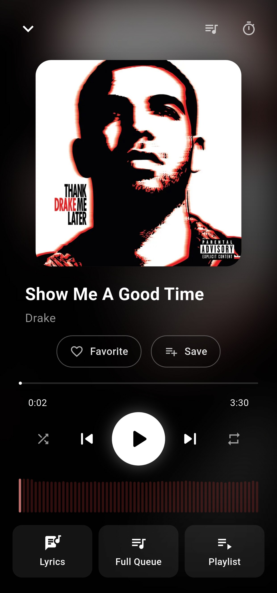
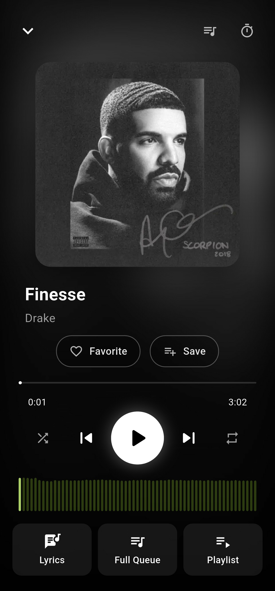
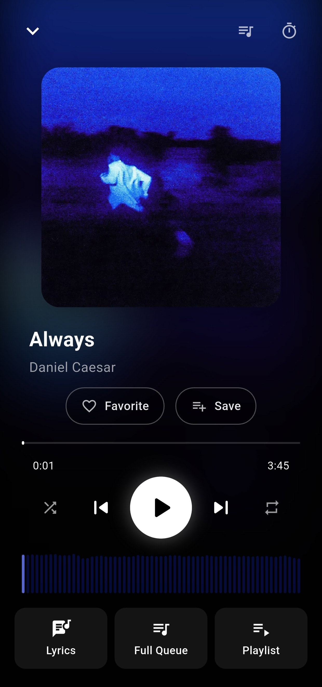

# Celsuis

A sleek offline music player for Android that plays your local music library — no account, no streaming, no ads. Everything runs on-device.

## Screenshots

| Home / Library | Now Playing | Queue |
| --- | --- | --- |
|  |  |  |

## Features

- **Local library scan** — pick folders to scan; songs, albums, artists and genres are indexed automatically
- **Playlists** — create and manage your own playlists, reorder songs with drag & drop
- **Background playback** — keeps playing with lockscreen / notification media controls (audio_service)
- **Shuffle & repeat** — smart shuffle that keeps your current song context; all, one, and off repeat modes
- **Queue** — inspect, reorder, and jump around the upcoming queue
- **Now Playing** — full-screen player with artwork, colors extracted from the album art, and a mini player on every tab
- **Lyrics** — timed lyrics view for the current track
- **Stats** — listening statistics for your library
- **Themes** — light, dark, and a set of custom color presets (Ocean, Nord, Rose Pine, Matrix, Cyberpunk, Custom)
- **Offline-first** — all data (library, playlists, settings) is persisted locally with Hive

## Tech stack

- Flutter (Material 3) with Riverpod for state management
- `just_audio` + `audio_service` for background playback
- `Hive` for local persistence (with generated boxes for songs, playlists, settings)
- `go_router` for navigation

## Getting started

```bash
flutter pub get
flutter run
```

The app requests storage permissions on first launch so it can scan your audio folders.

## Icons & artwork

All launcher, splash, and notification icons are generated from the design master in `icon_concepts/` via the Python scripts (`build_icons.py`, `generate_icons.py`). Don't edit generated PNGs directly — re-run the scripts instead.

## Build

```bash
flutter build apk
```

## Acknowledgements

This project was developed with AI assistance:

- **KAT-Coder-V2.5-Dev** — the primary coding assistant, very reliable at following instructions and turning feature requests into working code
- **DeepSeek V4 Flash** — secondary assistant used for larger codegen and review passes

Human oversight, design direction, and testing were provided throughout development.