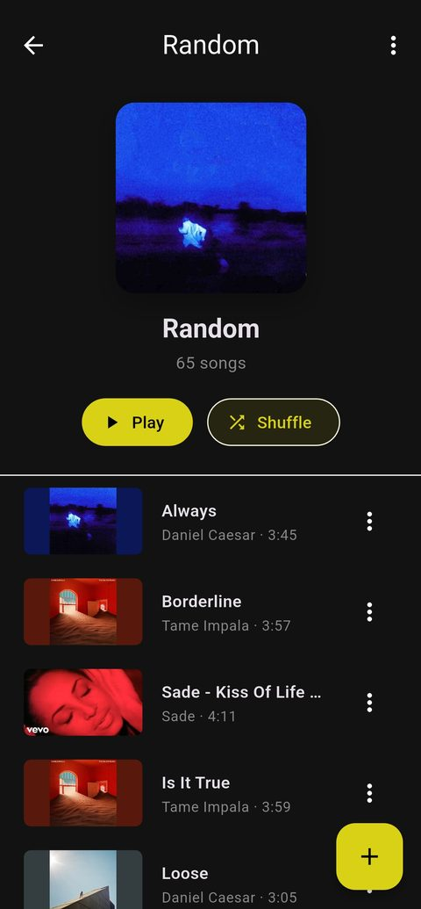

# Celsuis

A sleek offline music player for Android that plays your local music library — no account, no streaming, no ads. Everything runs on-device.

## Screenshots

| Home | Playlists | Queue | Now Playing |
| --- | --- | --- | --- |
|  |  |  |  |

## Features

- **Local library scan** — pick folders to scan; songs, albums, artists and genres are indexed automatically
- **Playlists** — create and manage your own playlists, reorder songs with drag & drop
- **Background playback** — keeps playing with lockscreen / notification media controls (audio_service)
- **Shuffle & repeat** — smart shuffle that keeps your current song context; all, one, and off repeat modes
- **Queue** — inspect, reorder, and jump around the upcoming queue
- **Now Playing** — full-screen player with artwork, colors extracted from the album art, and a mini player on every tab
- **Lyrics** — timed lyrics view for the current track
- **Stats** — listening statistics for your library
- **Themes** — system, light, dark, and color presets (Riso Zine, Nord, Paper Press, Matrix, Pocket LCD, Custom), plus four Now Playing skins (Classic, Riso Zine, Paper Press, Pocket LCD) with their own fonts and artwork treatments
- **Offline-first** — all data (library, playlists, settings) is persisted locally with Hive

## Themes

**App presets** — pick one in *Settings → Theme Preset*: System, Light, Dark, Riso Zine, Nord, Paper Press, Matrix, Pocket LCD, or Custom (pick your own primary + accent colors).

**Now Playing skins** — pick one in *Settings → Appearance → Now Playing Theme*:

| Skin | Look |
| --- | --- |
| Classic | Original dark design — blurred artwork with dominant-color accents (default) |
| Riso Zine | Cream risograph print: halftone patches, pink/blue inks, star badge, Archivo Black |
| Paper Press | Warm paper zine: grain + vignette, tape corners, brick-red ink, Playfair Display |
| Pocket LCD | Handheld dot-matrix: olive screen, pixel grid, LCD seek bar, VT323 / Press Start 2P |

Choosing a matching app preset (Riso Zine, Paper Press, or Pocket LCD) switches the Now Playing skin to match automatically — the skin stays independently adjustable afterwards.

## Tech stack

- Flutter (Material 3) with Riverpod for state management
- `just_audio` + `audio_service` for background playback
- `Hive` for local persistence (with generated boxes for songs, playlists, settings)
- `go_router` for navigation

## Getting started

```bash
flutter pub get
flutter run
```

The app requests storage permissions on first launch so it can scan your audio folders.

## Icons & artwork

All launcher, splash, and notification icons are generated from the design master in `icon_concepts/` via the Python scripts (`build_icons.py`, `generate_icons.py`). Don't edit generated PNGs directly — re-run the scripts instead.

## Build

```bash
flutter build apk
```

## Acknowledgements

This project was developed with AI assistance:

- **KAT-Coder-V2.5-Dev** — the primary coding assistant, very reliable at following instructions and turning feature requests into working code
- **DeepSeek V4 Flash** — secondary assistant used for larger codegen and review passes

Human oversight, design direction, and testing were provided throughout development.